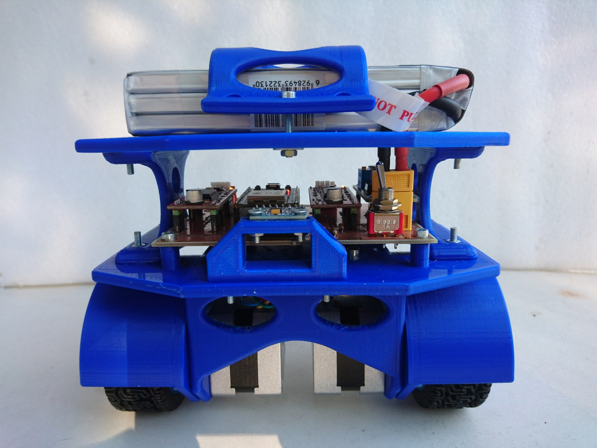
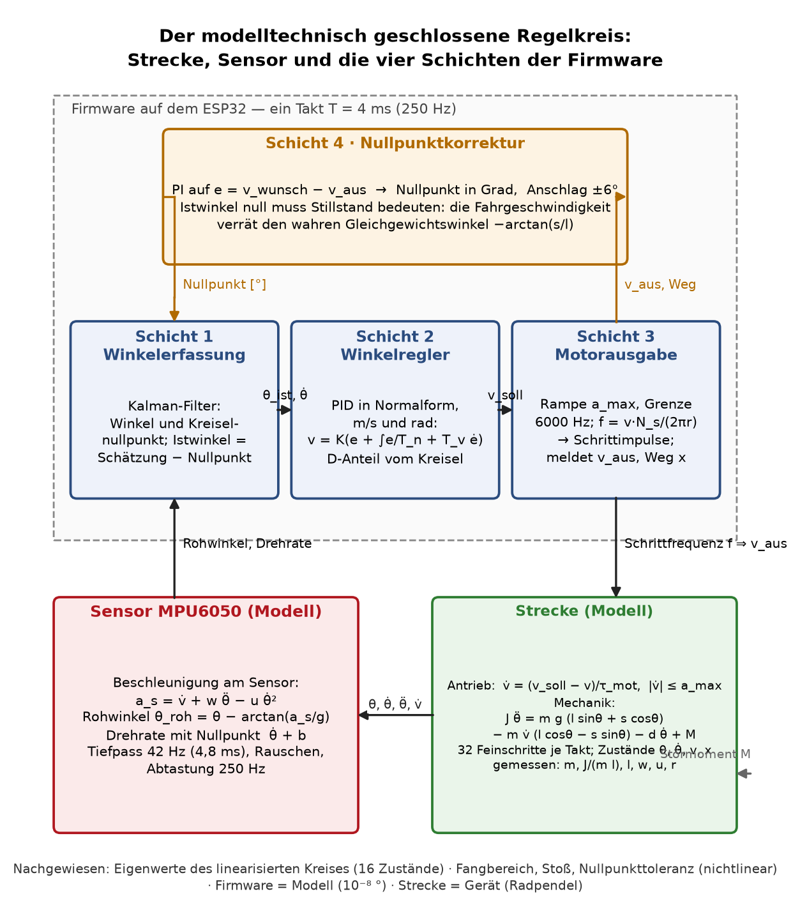

# Ein Segway auf zwei Schrittmotoren: Modell, Auslegung, Nachweis

Prof. Dr.-Ing. Ralph Wystup M.Sc. — erstellt mit KI und Agent (Claude Code, Anthropic)

**Seite öffnen:** https://ralphwystup.github.io/Segway-Regelung-mit-ESP32-und-Schrittmotoren/ — das Segway-Labor 1.2: Simulation des Fahrzeugs mit Regler, Sensorkette und
Nullpunktkorrektur im Browser, Wiedergabe wie im Versuch, Reglerauslegung durch Simulation, das Manuskript als
Dokumentation in der Seite. Läuft offline.

Ein zweirädriges Einachsfahrzeug mit ESP32, zwei Schrittmotoren und MPU6050 hält sich selbst aufrecht.
Hier ist die Regelung nicht erprobt, sondern gerechnet: erst das Gesamtsystem als reines Modell — die
Bewegungsgleichung exakt hergeleitet, mit den gemessenen Zahlen des Geräts belegt, linearisiert als Zustandsmodell
mit Ein- und Ausgang und als Übertragungsfunktion im Laplace-Bereich —, dann die Schnittstellen zum abgetasteten
Regler, daraus die Anforderungen, dann der digitale Regler in vier Schichten und der geschlossene Kreis im Laplace-
und im z-Bereich mit der Korrektur der Reglerparameter. Die Firmware rechnet Zeile für Zeile dasselbe wie das
Modell (Abweichung 2·10⁻⁸ Grad über 3000 Takte).

**Video:** [`Video_Segway_steht_frei.mp4`](Video_Segway_steht_frei.mp4) — das Fahrzeug steht frei auf dem Boden und hält sich selbst aufrecht (13 s, Studentenfassung der Regelung vom März 2026).

**Einführung:** [`EINFUEHRUNG_Segway.pdf`](EINFUEHRUNG_Segway.pdf) — der Segway im Bild: das Gerät, die reale Strecke mit ihrer
Bewegungsgleichung und Übertragungsfunktion im abgetasteten Regelkreis, dieselbe Struktur als Simulation und am ESP32, die
Hardwaremodule mit ihren Schnittstellen, der Hardwaretest; alle Größen als Variablen mit Seitenverweis ins Manuskript, die Werte in Tabellen.

**Manuskript:** [`MANUSKRIPT_Segway_Gesamt_F6.pdf`](MANUSKRIPT_Segway_Gesamt_F6.pdf) — Fassung 6 · 29. September 2026. **Prüfprotokoll des Modellkapitels:**
[`PRUEFPROTOKOLL_Modellkapitel.pdf`](PRUEFPROTOKOLL_Modellkapitel.pdf) — 29 Prüfungen mit Schranke, 0 Beanstandungen.

## Was drin ist

| Datei | Inhalt |
|:--|:--|
| [`Video_Segway_steht_frei.mp4`](Video_Segway_steht_frei.mp4) | das Fahrzeug steht frei und balanciert (13 s, ohne Ton) |
| [`EINFUEHRUNG_Segway.pdf`](EINFUEHRUNG_Segway.pdf) / [`.md`](EINFUEHRUNG_Segway.md) | Einführung mit sieben Bildern (Querformat) und den Tabellen der Größen; Prüfprotokoll [`PRUEFPROTOKOLL_Einfuehrung.pdf`](PRUEFPROTOKOLL_Einfuehrung.pdf): Bilder = Firmware = Modell = Labor, Seitenverweise geprüft |
| [`Segway_Labor_1.2.html`](Segway_Labor_1.2.html) | das Segway-Labor: Strecke, Sensor und vier Schichten Zeile für Zeile wie Firmware und Python-Modell (geprüft auf 10⁻¹⁵ Grad), Versuche mit Anfangslage, Versatz, Stoß, Rauschen, Wiedergabe mit Fahrzeugbild, Auslegung durch Simulation; Dokumentation = Manuskript |
| [`MANUSKRIPT_Segway_Gesamt_F6.pdf`](MANUSKRIPT_Segway_Gesamt_F6.pdf) / [`.docx`](MANUSKRIPT_Segway_Gesamt_F6.docx) / [`.md`](MANUSKRIPT_Segway_Gesamt.md) | Teil I Gesamtsystem und Vorgehen · II Strecke: Herleitung, gemessene Zahlen, Zustandsmodell, Übertragungsfunktion, Abtastform, Simulationsmodell · III Sensor · IV Schnittstellen · V Anforderungen · VI Regler in vier Schichten · VII geschlossener Kreis: Zustandsmodell, Laplace- und z-Bereich, nichtlinearer Nachweis, Korrektur · VIII Inbetriebnahme · Anhänge |
| [`PRUEFPROTOKOLL_Modellkapitel.pdf`](PRUEFPROTOKOLL_Modellkapitel.pdf) | jede Zahl des Modellkapitels gegen die Rechnung, zwei Wege je Ergebnis, Bilder und Dokument geprüft |
| [`PRUEFPLAN_Labor.pdf`](PRUEFPLAN_Labor.pdf) | Prüfplan der Seite: Modell gegen Python, Bedienung im echten Browser, Wiedergabe |
| [`MASSE_UND_GEWICHTE.pdf`](MASSE_UND_GEWICHTE.pdf) | Maßblatt: Maße und Massen aus Konstruktion und Messung, Trägheitsmoment auf mehreren Wegen, die Pendelversuche |
| [`NACHWEIS_gemessen_2026-09-28.pdf`](NACHWEIS_gemessen_2026-09-28.pdf) | der Regler gegen die gemessene Strecke: Eigenwerte, Reserven, Fangbereich, Stoß, Nullpunkt |
| `firmware/segway_regelung.ino` | die Firmware für den ESP32 (Arduino, FastAccelStepper): vier Schichten, Kalman-Filter, Nullpunktkorrektur, OTA, Weboberfläche, Mitschnitt, Synchron-LED. Netzzugang in `wlan_zugang.h` nach der Vorlage `wlan_zugang.h.beispiel` eintragen |
| `einfuehrung/` | Erzeuger und Prüfmittel der Einführung (Seitenzahlen aus dem gesetzten PDF, Werte aus Firmware und Messung) |
| `labor/` | Erzeuger und Modell der Seite (`erstelle_segway_labor.py`, `segway_labor_modell.js`) und ihre Prüfmittel |
| `modell/` | Strecke, Sensor und vier Schichten als Simulation (`segway_modell.py`), lineare Analyse mit 16 Zuständen (`segway_entwurf.py`), Auslegung (`suche_entwurf.py`), nichtlinearer Nachweis (`pruefung_entwurf.py`), Nachweis mit den gemessenen Größen (`nachweis_gemessen.py`), Zustandsmodell und Übertragungsfunktion (`uebertragungsfunktion.py`), Prüfprotokoll (`pruefe_modellkapitel.py`), Firmware = Modell (`gegenprobe_*`) |
| `konstruktion/` | Maße aus den STL-Dateien, Trägheitsmoment aus der Konstruktion, Auswertung der Pendelvideos (Merkmalspunkte und RANSAC, Doppelpendel) |
| `pruefstand/`, `bilder/` | Zeichnung des Prüfstands, Skizzen, Fotos, Blockschaltbilder, Simulationsbilder und ihr Erzeuger |
| `baue_manuskript.sh` | baut Bilder, Rechnung, PDF und DOCX und lässt das Prüfprotokoll laufen |
| `index.html` | leitet auf die Seite weiter, damit GitHub Pages sie unter der Adresse oben zeigt |

Alle Zahlen sind gerechnet oder gemessen; wo etwas angenommen ist, steht es dabei. Was am Gerät noch zu messen
ist (Motorgrenze, Treiberverzug, Rauschen), steht im Manuskript, Teil VIII.

## Nachrechnen

    cd modell
    python3 nachweis_gemessen.py        # Nachweis mit den gemessenen Größen (etwa 80 s)
    python3 uebertragungsfunktion.py    # Zustandsmodell, Übertragungsfunktion, Kreis im Laplace-Bereich, Bilder
    python3 gegenprobe_lauf.py          # Firmware = Modell
    cd ../labor && node pruefe_labor_modell.mjs   # JavaScript-Modell = Python-Modell

Benötigt Python 3 mit numpy, scipy, matplotlib; für die Seite Node.js und Playwright (nur zum Prüfen).
Die Firmware übersetzt mit arduino-cli (`esp32:esp32:esp32`) und der Bibliothek FastAccelStepper.

## Lizenz

MIT, siehe [LICENSE](LICENSE).
